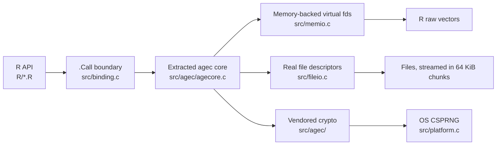

# Architecture

This document describes how `agecrypt` is implemented. For the rationale behind
the native backend and public API, see
[decisions/001-native-agec-backend.md](decisions/001-native-agec-backend.md) and
[decisions/002-public-api-shape.md](decisions/002-public-api-shape.md).

## System overview



The package has one built-in backend. The reference `age` or `rage` CLI is a
test oracle, never a runtime dependency.

## R layer

`R/` is organized by I/O shape:

- `raw.R` contains the primitive buffer transformations
  `age_encrypt_raw()` and `age_decrypt_raw()`.
- `text.R` composes text helpers over the raw primitives.
- `file.R` uses dedicated native file paths so large files remain
  constant-memory operations.
- `passphrase.R` contains the separate scrypt `_passphrase` functions.
- `identity.R` and `recipients.R` handle keys and input normalization.
- `conditions.R` maps native status values to structured R conditions.

Default paths, text encoding, passphrase prompting, identity auto-detection, and
condition signalling stay in R.

## Native call contract

`src/binding.c` implements the native entry points registered by `src/init.c`.
Every entry point returns a length-two R list:

```text
(status, payload)
```

- `status == ""` means success.
- A non-empty status is an error-class suffix such as `"identity"`,
  `"decrypt"`, or `"io"`.
- `age_result()` in `R/conditions.R` turns that suffix into an
  `age_error_<suffix>` condition through `age_abort()`.

Native operations must not call `Rf_error()` or otherwise longjmp while buffers
or file descriptors are open. They return an error status after cleanup; R then
signals the condition.

The status suffixes must stay aligned with these public condition classes:

| Native suffix | R condition |
|---|---|
| `recipient` | `age_error_recipient` |
| `identity` | `age_error_identity` |
| `encrypt` | `age_error_encrypt` |
| `decrypt` | `age_error_decrypt` |
| `io` | `age_error_io` |

All inherit from `age_error`.

## Extracted agec core

Upstream agec is a CLI, not a library. Its encryption and decryption
orchestration was extracted into `src/agec/agecore.c` and
`src/agec/agecore.h`:

- `age_encipher()` and `age_decipher()` handle X25519 recipients.
- Their `_passphrase` variants handle scrypt-encrypted files.
- Keys are passed as flat arrays of 32-byte values.
- The core follows agec's convention: `NULL` means success and a
  `const char *` is an error message.

The R binding currently exposes thirteen native entry points: identity
generation, parsing, public-key derivation, writing and freeing; raw and file
recipient encryption/decryption; and raw and file passphrase
encryption/decryption.

Recipients do not have a separate parse entry point. Their `"age1..."` strings
are validated and consumed inside encryption calls.

## Memory and file I/O

agec's `Ibuf` and `Obuf` abstractions operate on integer file descriptors. Two
package-owned adapters let the same core serve both R I/O shapes:

- `src/memio.c` allocates negative virtual descriptors. `ageread()` and
  `agewrite()` dispatch these to expandable memory buffers used by raw-vector
  operations.
- `src/fileio.c` operates on real descriptors for file-to-file streaming.
  Payloads are processed in 64 KiB STREAM chunks without loading the whole file
  into R memory.

R connections are not file descriptors. Supporting them would require a
callback-backed `Ibuf`/`Obuf` implementation that calls into R.

## Concurrency

The backend has process-global mutable state:

- the error buffer `ebuf` in `src/agec/util.c`;
- the virtual-descriptor table in `src/memio.c`.

It is therefore not reentrant. Run native operations on R's main thread, one at
a time. Do not invoke them from threaded worker pools or re-enter them from a
callback.

## Identity lifecycle and secrecy

An `age_identity` is a lightweight S3 object around an opaque external pointer.
One C-side allocation stores all identities held by the object.

- Secret bytes are not copied into ordinary R vectors.
- Decrypting with multiple identities is one native call that loops over
  identities and stanzas in C.
- `print()` and `format()` derive and show public recipients only.
- There is no secret accessor or `as.character()` method.
- The external-pointer finalizer scrubs secret bytes before freeing memory.
- `age_keygen(path = ...)` is the supported persistence path for generated
  identities.

## Randomness and platform support

`src/platform.c` replaces upstream `unix/random.c`:

- Unix and macOS use `getentropy()` or `arc4random_buf()`.
- Windows uses `BCryptGenRandom()` and links `-lbcrypt`.

There is no OpenSSL runtime dependency. Compiled objects must not call
`exit()` or `abort()` and must not write to standard streams. The upstream CLI
drivers that do those things are not compiled.

## Source ownership and build layout

The package-owned native files are:

- `src/binding.c`
- `src/init.c`
- `src/memio.c`
- `src/platform.c`
- `src/fileio.c`
- `src/agec/agecore.c`
- `src/agec/agecore.h`
- `src/agec/agec.h`
- `src/agec/memio.h`
- `src/agec/fileio.h`

Most other files under `src/agec/`, including `src/agec/crypto/`, are vendored.
See [vendoring-agec.md](vendoring-agec.md) and
[`inst/COPYRIGHTS`](../inst/COPYRIGHTS) for exact provenance and modifications.

`src/Makevars` and `src/Makevars.win` list compiled objects explicitly. Both
use `-iquote`, rather than `-I`, so agec's quoted `io.h` does not shadow the
Windows system `<io.h>`.
